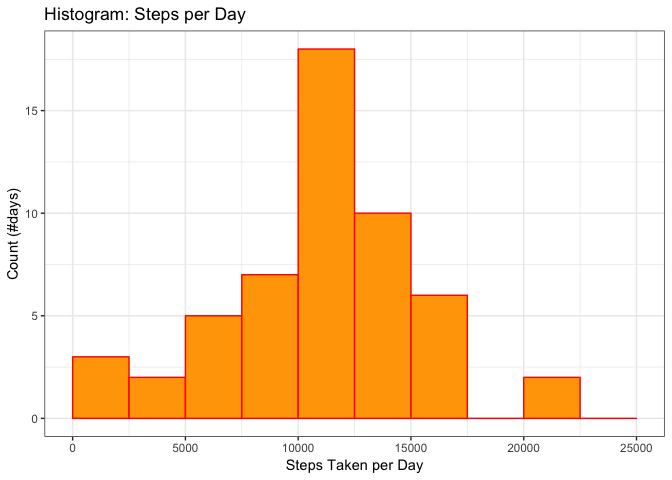
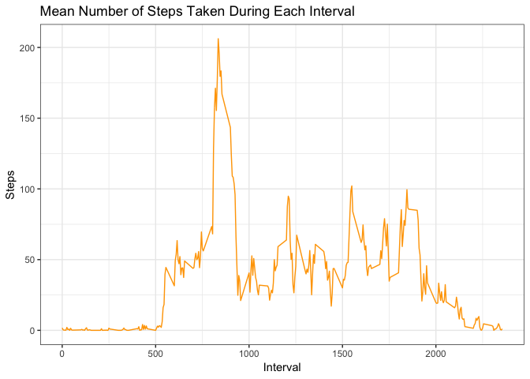
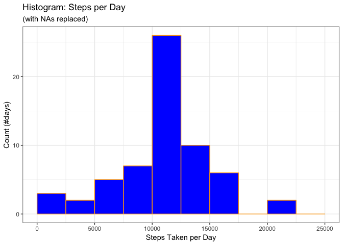
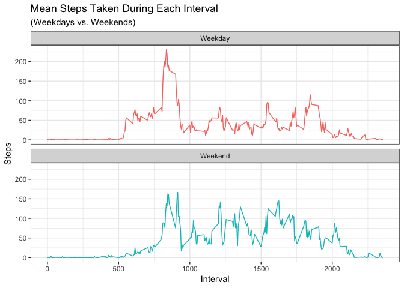

#### Loading and preprocessing the data
Show any code that is needed to:

1. Load the data 
2. Process/transform the data (if necessary) into a format suitable for your analysis


```r
library(lubridate)
library(ggplot2)
library(dplyr)

data <- read.csv("activity.csv")
data$date <- ymd(data$date)
```

#### Q1. What is mean total number of steps taken per day?
For this part of the assignment, you can ignore the missing values in the dataset.

1. Calculate the total number of steps taken per day
2. If you do not understand the difference between a histogram and a barplot, research the difference between them. Make a histogram of the total number of steps taken each day
3. Calculate and report the mean and median of the total number of steps taken per day


```r
dataDaily <- data %>% group_by(date) %>%
        summarise(steps_day = sum(steps))

dailyMean <- mean(dataDaily$steps_day, na.rm = TRUE)
dailyMedian <- median(dataDaily$steps_day, na.rm = TRUE)
```

The daily mean amount of steps taken is ``10766.19`` and the median daily amount of steps taken is ``10765``.

Now we can plot a histogram showing the distribution of the daily total amounts of steps taken:


```r
ggplot(data = dataDaily, aes(x = steps_day)) +
        theme_bw() +
        geom_histogram(breaks = seq(0, 25000, by = 2500),
                col = "red",
                fill = "orange") +
        labs(title = "Histogram: Steps per Day", 
             x = "Steps Taken per Day",
             y = "Count (#days)") 
```

<!-- -->

The histogram is quite concentrated around the mean and median values, but the left tail is fat (i.e. on quite a few days the subjects took an extremely low number of steps).

#### Q2. What is the average daily activity pattern?
1. Make a time series plot of the 5-minute interval (x-axis) and the average number of steps taken, averaged across all days (y-axis)
2. Which 5-minute interval, on average across all the days in the dataset, contains the maximum number of steps?


I start by grouping the data by interval, and calculating the mean by group. This will give us a data frame with the mean (across all days) number of steps taken during the various 5 minute intervals. The resulting graph will give us a chart of walking activity in different moments of a typical (i.e. mean) day.


```r
dataInterval <- data %>% group_by(interval) %>%
        summarise(steps_interval = mean(steps, na.rm = TRUE))

max(dataInterval$steps_interval)
```

```
## [1] 206.1698
```

```r
dataInterval[which.max(dataInterval$steps_interval), ]$interval
```

```
## [1] 835
```

The highest amount of steps taken during an interval is ``206.1698113``.
This happens at interval ``835``, which means during the 5-minute interval ending at 8:35 AM.

We can now plot the line graph showing the activity during an average day: 


```r
ggplot(data = dataInterval, aes(x = interval, 
        y = steps_interval)) +
        
        geom_line(color = "orange") +
        theme_bw() +
        labs(title = "Mean Number of Steps Taken During Each Interval", 
             x = "Interval",
             y = "Steps") 
```

<!-- -->

#### Q3. Imputing missing values
Note that there are a number of days/intervals where there are missing values (coded as NA). The presence of missing days may introduce bias into some calculations or summaries of the data.

1. Calculate and report the total number of missing values in the dataset (i.e. the total number of rows with NAs)
2. Devise a strategy for filling in all of the missing values in the dataset. The strategy does not need to be sophisticated. For example, you could use the mean/median for that day, or the mean for that 5-minute interval, etc.
3. Create a new dataset that is equal to the original dataset but with the missing data filled in.
4. Make a histogram of the total number of steps taken each day and Calculate and report the mean and median total number of steps taken per day. Do these values differ from the estimates from the first part of the assignment? What is the impact of imputing missing data on the estimates of the total daily number of steps?


```r
NAsCount <- sum(is.na(data$steps))
```

There are indeed ``2304`` NA values in the dataset.
I will construct a complete dataset by substituting the NAs with the mean value of steps during that interval. I already have this information since it was used in question 2 to plot the by-interval line graph.


```r
dataComplete <- data
dataComplete[is.na(data$steps), 1] <- dataInterval[, 2]

completeDaily <- dataComplete %>% group_by(date) %>%
        summarise(steps_day = sum(steps))
```

Now I can plot a new histogram to see if substituting the NAs significantly changed the distribution relative to what observed in Q1.


```r
ggplot(data = completeDaily, aes(x = steps_day)) +
        geom_histogram(breaks = seq(0, 25000, by = 2500),
                       col = "orange",
                       fill = "blue") +
        theme_bw() +
        labs(title = "Histogram: Steps per Day", 
             subtitle = "(with NAs replaced)",
             x = "Steps Taken per Day",
             y = "Count (#days)")
```

<!-- -->

The histogram shows the distribution to be even more concentrated around the mean value, relative to how it looked in Q1.


```r
completeMean <- mean(completeDaily$steps_day)
completeMedian <- median(completeDaily$steps_day)
```

The daily mean amount of steps taken using to completed dataset is ``10766.19`` and the median daily amount of steps taken is ``10766.19``.

#### Q4. Are there differences in activity patterns between weekdays and weekends?

For this part the weekdays() function may be of some help here. Use the dataset with the filled-in missing values for this part.

1. Create a new factor variable in the dataset with two levels – “weekday” and “weekend” indicating whether a given date is a weekday or weekend day.
2. Make a panel plot containing a time series plot of the 5-minute interval (x-axis) and the average number of steps taken, averaged across all weekday days or weekend days (y-axis).

I construct a factor variable ```weekend``` to identify the days that are either Saturdays or Sundays.


```r
dataComplete$day_of_week <- weekdays(dataComplete$date)
dataComplete$weekend <- as.factor(ifelse(dataComplete$day_of_week == "Saturday" | dataComplete$day_of_week == "Sunday", 
       "Weekend", "Weekday"))

completeInterval <- dataComplete %>% 
        group_by(weekend) %>% group_by(interval, add = TRUE) %>%
        summarise(steps = mean(steps, na.rm = TRUE))
```

Now I can plot separately the average activity on weekends and weekdays.


```r
ggplot(data = completeInterval, aes(x = interval, y = steps, color = weekend)) +
        geom_line() +
        theme_bw() +
        facet_wrap("weekend", ncol = 1, nrow=2) +
        labs(title = "Mean Steps Taken During Each Interval", 
             subtitle = "(Weekdays vs. Weekends)",
             x = "Interval",
             y = "Steps") +
        theme(legend.position = "None")
```

<!-- -->

Unsurprisingly, on weekends activity is more muted in the very early hours of the morning, but stays at higher levels during the afternoons and evenings.
